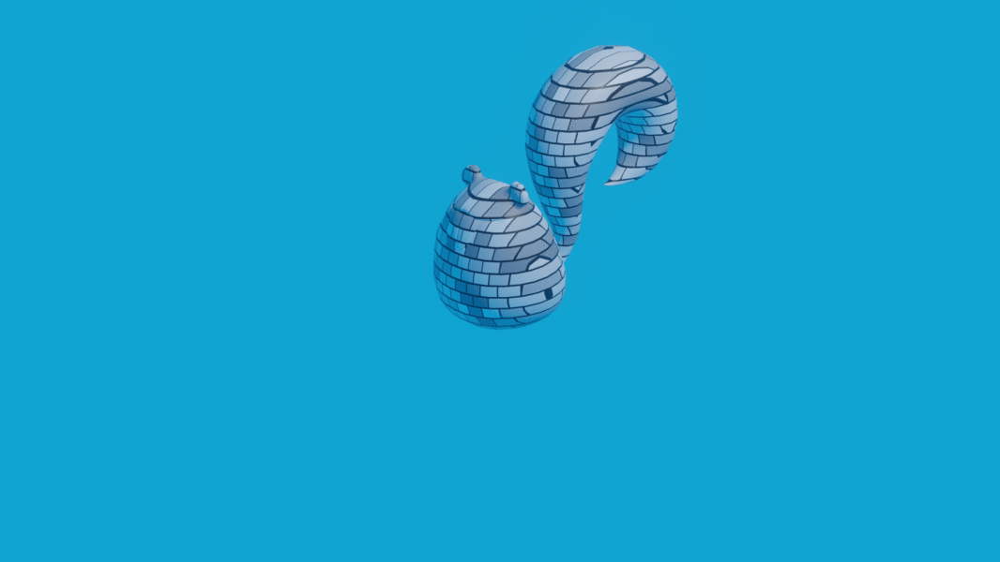
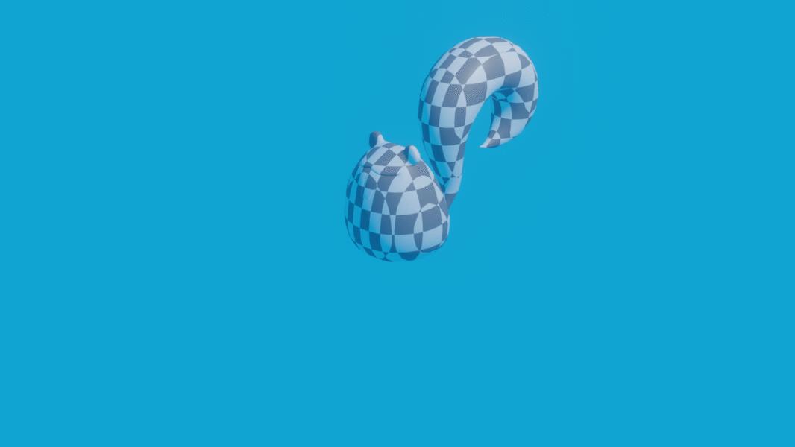

# Homework 3: Keyframe animation

This repository contains the solutions to the third homework for the Master's studies course Advanced Computer Graphics at the Faculty of Computer and Information Science, University of Ljubljana.

The basic Catmull-Rom splines interpolation is used, in order to interpolate objects through time.

## Contents
- `data` folder contains the input files.
- `data_out` folder contains the interpolated obj files, rendered images, gifs and videos.
- `interpolate.jar` is a java executable jar file, also in `out/artifacts/HW3_jar`.
- `NRG_DN3_instruction.pdf` contains the assignment instructions.

## Running the interpolation process
```
java -jar interpolate.jar <framerate> <time range start> <time range end> <tension [0-1]> <description file path(with '/')> <input frames directory(with '/')> <output directory (with '/')>

# Example:
java -jar interpolate.jar 100 0 9120 0.5 data/input_03.txt data/ data_out/input_03_framerate100_from0_to9120_tension0_5/
```

## Results:
Input `input_00.txt`, Framerate 100, Start 0, End 9000, Tension 0.5


Input `input_01.txt`, Framerate 100, Start 0, End 6500, Tension 0.5


Input `input_02.txt`, Framerate 100, Start 0, End 5000, Tension 0.5


Input `input_03.txt`, Framerate 100, Start 0, End 9120, Tension 0.5


